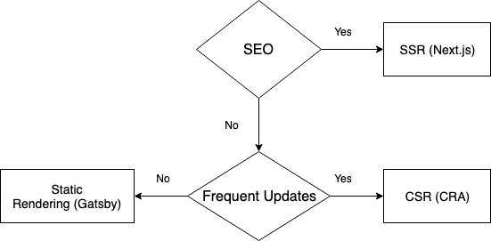

Sometimes we are faced with the dilemma while choosing correct tool
for the job and front end is no different. There are many deciding
factors such has SEO, frequency of updates etc. and for each of them
we need to make informed choices.

The three main criteria are:

* You need to make web crawlers happy (SEO).

* You need to update the content frequently and need to avoid server roundtrips for full page reload.

* Your content rarely updates eg. Blogs.

The following flow chart summarises the ecosystem in the React ecosystem so far.

### Wrapping up...

This just the tip of [iceberg](https://developers.google.com/web/updates/2019/02/rendering-on-the-web) and there
are some hybrid approaches (Rehydration, Prerendering etc.) which needs to be explored on need basis.
