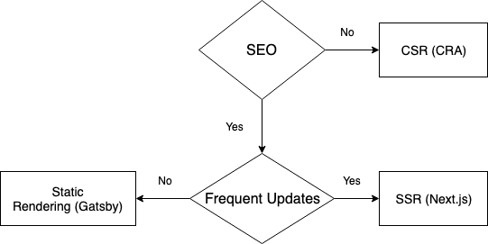

Sometimes we are faced with the dilemma while choosing correct tool
for the job and front end is no different. There are many deciding
factors such has SEO, frequency of updates etc. and for each of them
we need to make informed choices.

The three main criteria are:

* You need to make web crawlers happy (SEO).

* You need to update the content frequently and need to avoid server round trips for full page reload.

* Your content rarely updates eg. Blogs.

Key techniques for showing a web page to a client:

## SSR (Server side rendering)

Pre rendering the page with all the data before sending it to the client.

#### Pros

* Web crawlers can index the page.

* Link bots can show page preview (eg: Slack).

* Faster initial page load because of reduced javascript payload.

#### Cons

* Increased load on server.

----

## SPA (Single page application)

Server sends the application shell and then client loads the required data by
making Ajax calls, all the logic is handled on the client side.

#### Pros

* Good for highly dynamic web sites.

#### Cons

* The javascript payload increases rapidly with the application complexity.

---

## Static rendering

Precompute all the application routes and create static HTML for them.
The resulting page contains little or no javascript.

#### Pros

* Fast load time with almost no javascript.

* Improved caching using edge caches.

#### Cons

* Not good fit for dynamic sites as it needs to be built for each change.

---

---

### Wrapping up...

Other techniques which deserve to be mentioned are:

* Pre-rendering.

* Rehydration.

* Streaming server rendering.

This just the tip of [iceberg](https://developers.google.com/web/updates/2019/02/rendering-on-the-web) and there
are some hybrid approaches (Rehydration, Prerendering etc.) which needs to be explored on need basis.
